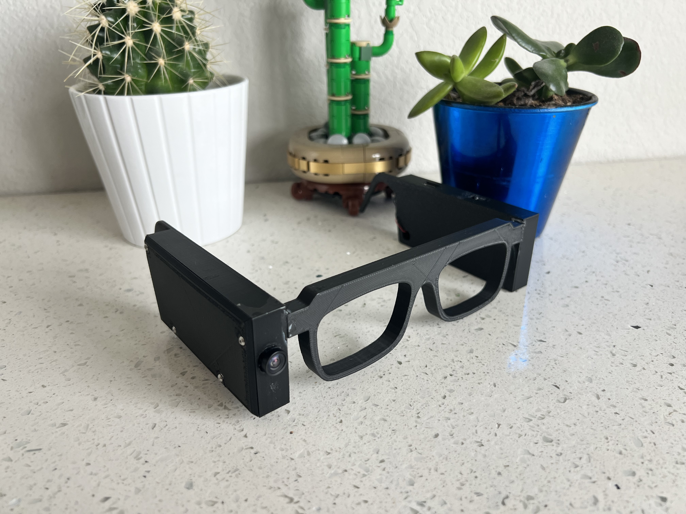
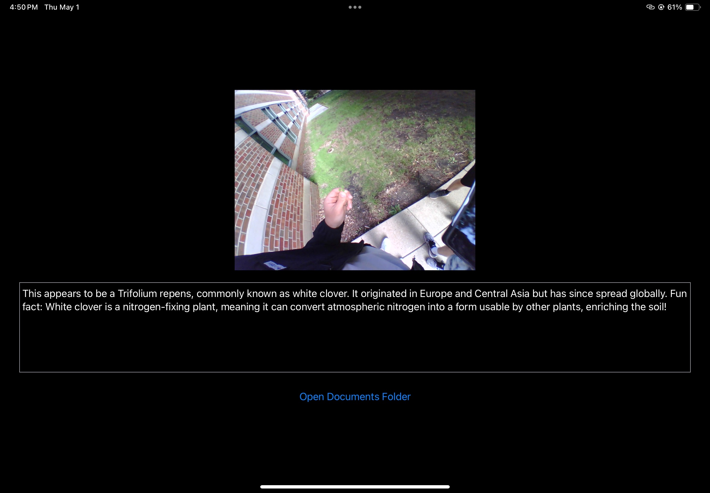

# Problem
Have you ever seen an object that piqued your interest, but you didn’t have an efficient way of researching what it was? Repeatedly searching online to identify the subject can be a lengthy and tedious task, and this is the problem we seek to address. Our solution is meant to enlighten our users about unknown plants, animals, or objects in any setting they are observing.
Furthermore, an auditory aid can be further applied to helping the visually impaired, giving context to the surroundings that they would otherwise be unable to fathom or see. A multifaceted solution to spatial object recognition problems is what we are trying to accomplish with the AARG glasses.

# Solution
Our project idea stems from the surge of AR prototype glasses being introduced over the past year. We are planning to create our own glasses, but in contrast to those on the market, ours will focus on the audio experience of the user. These glasses will have the explicit capability of capturing images of objects and relaying this information to an application that will process these images in the backend. The application will then send an explanation of the object back to an audio device on the glasses (either a speaker or a bone-conducting device). 
The glasses will essentially work as a digital tour guide, with the explanation of the object being auditory rather than visual. The use case we have decided to tackle is a botanical tour guide, but the purpose is to create a platform that other applications can utilize for their objectives. Other objectives include, but are not limited to the following:
* Accessibility for the visually impaired
* Language translation
* Tourism and museum tour guide
* Security and Surveillance
* Visual Aid

# High-Level Requirements
## Fast Computation Time
The time taken for the user to obtain audio feedback from the glasses system should not exceed 12 seconds. This value was obtained from experimentation of timing LLMs trying to identify unknown plants, along with references based on the summation of GPT backend processing time with hardware communication relay times. Reach Goal: 6 seconds
Conclusion: Out of 40 trials, all 40 of them were below our threshold of 12 seconds (ranging between 5 to 10 seconds). 20% of these trials also met our reach goal.

## Accuracy
The final prototype should be able to correctly identify plants 85% of the time. This will be based on our application subsystem, which will use a model to determine the plant’s classification. We will test the device on 20 plants and expect to get 17 out of the 20 correct. Reach Goal: 90% accuracy
Conclusion: Out of 40 trials, 35 of the tests classified the plants correctly, resulting in an accuracy percentage of 87.5%.

## Final Prototype Weight
The final prototype will weigh no more than 200 grams. We obtained this value from researching similar augmented reality headsets and aim to make our final prototype lighter than headsets on the market, but still lightweight enough to be comfortably worn, similar to commercial glasses, throughout the day. Reach Goal: 100 grams
Conclusion: Weighing the final prototype gave us a weight of 136 grams.

# Accomplishments
Overall, the project achieved the vast majority of its intended functionality. The push button, as intended, started the glasses system by prompting the image capture. After the image capture, the microcontroller fed the image to our developed application, which then identified what was in the image and sent an appropriate audio prompt back to the microcontroller. Additionally, the lithium-ion battery is capable of being recharged via USB-C.

The final report can be found [here](FINAL_REPORT.pdf).